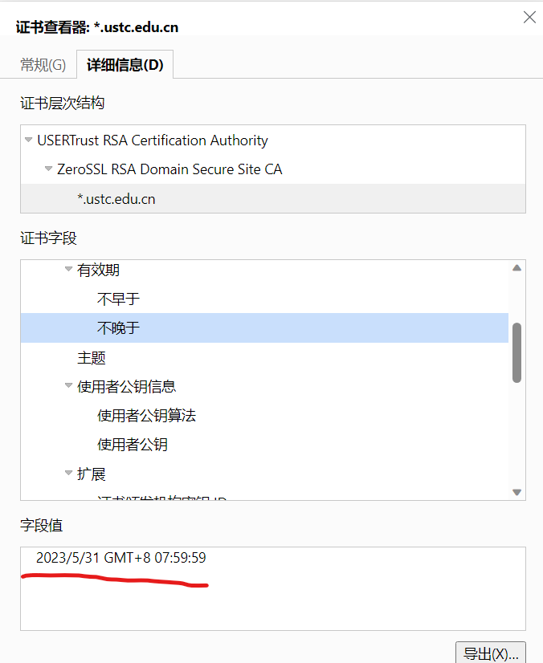
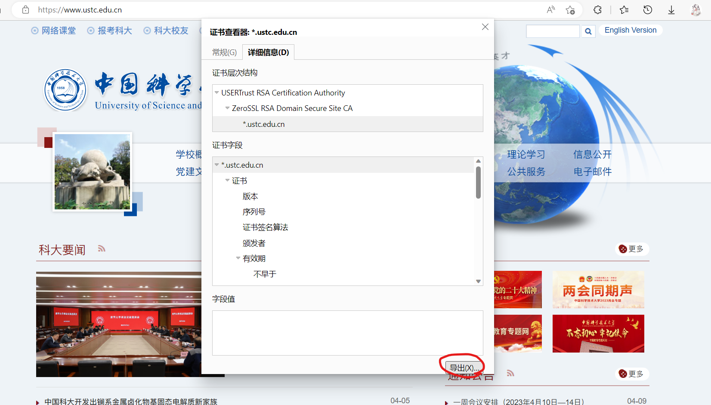
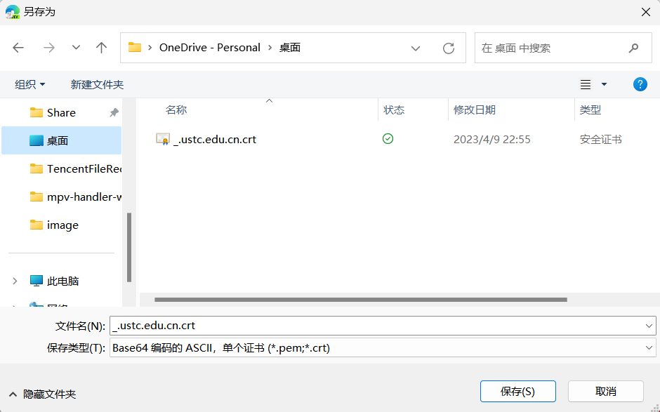
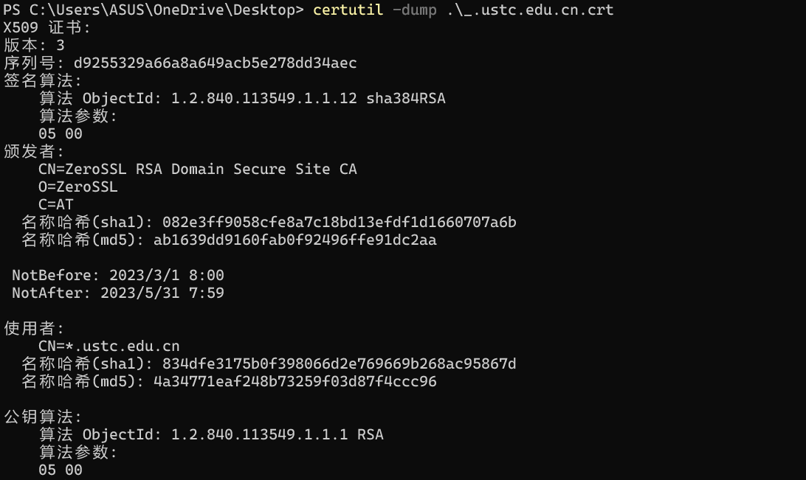
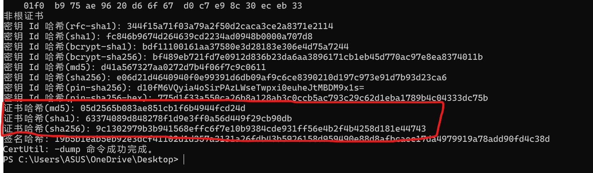
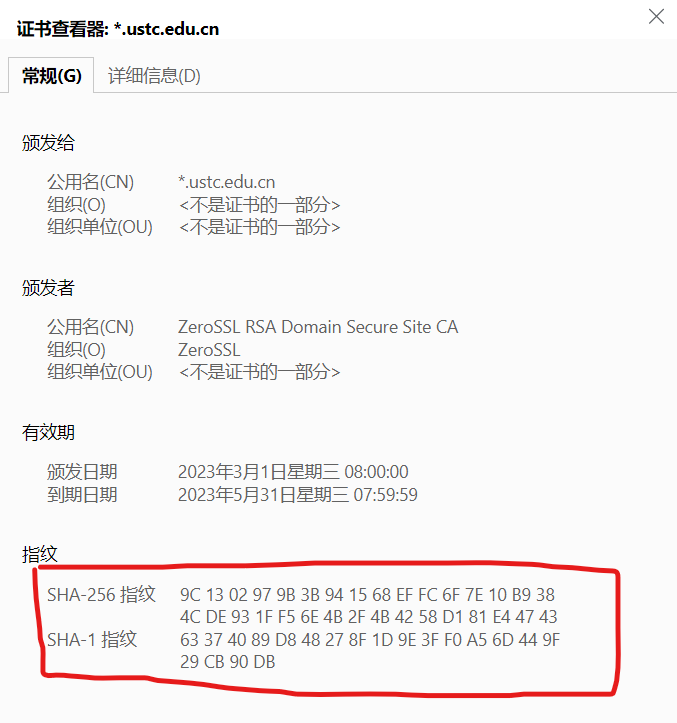

# Homework 1
## 
##2.
使用不同模式处理分组密码的原因：在实际应用中，需要加密的消息数据量是不定的，数据格式是多种多样的，因此需要不同的模式来进行加密，以提高整体的安全性。
CBC模式：对于第一个分组首先构造一个长度为分组长度的初始向量，然后与第一个明文分组进行异或形成第一个密文分组。后续明文分组都与前一个形成的密文分组进行异或后加密。
CTR模式：CTR模式通过对逐次累加的计数器加密来生成密钥分组，与明文分组异或产生密文分组。解密时将密文和明文分组位置调即可。
CTR与CBC模式的对比：CTR模式可以并行加密多个分组，而CBC模式需要前一个明文分组加密完成才能进行下一个明文分组的加密。CBC模式对于相同的明文也可能产生不同的密文，隐藏了明文的统计特性。CBC密文分组中的一个比特的错误会影响到本组和后面分组的解密。

##3.
产生哈希冲突的原因：通过哈希函数产生的哈希值是有限的，而当明文较多时，输入多于输出，就会有不同的明文产生相同的哈希值。哈希函数具有抗碰撞性，即任何一个攻击者不能在多项式时间内找到x1和x2使得x1$\ne$x2,且H(x1)=H(x2)。

##4. 
以*.ustc.edu.cn举例
可查看其有效期:

将其导出为文件:

使用`certutil -dump`查看:

SHA1和SHA256与浏览器查看一致:

1. https://ustc.edu.cn/
   1. (root) USERTrust RSA Certification Authority
       - expired: 2038/1/19 GMT+8 07:59:59
       - MD5: 1bfe69d191b71933a372a80fe155e5b5
       - SHA256: e793c9b02fd8aa13e21c31228accb08119643b749c898964b1746d46c3d4cbd2
   2. ZeroSSL RSA Domain Secure Site CA
       - expired: 2030/1/30 GMT+8 07:59:59
       - MD5: 58aa23107c8d5aedeabd0d5e32578592
       - SHA256: 21acc1dbd6944f9ac18c782cb5c328d6c2821c6b63731fa3b8987f5625de8a0d
   3. ustc.edu.cn
       - expired: 2023/6/15 GMT+8 07:59:59
       - MD5: 044a344e9ba6146e4f5db7128ced4269
       - SHA256: 8d617c13fa32c7a2e1581c28086648cd698107fe7b57517e1213916e42375852
2. https://www.12306.cn
   1. (root)CFCA EV ROOT
       - expired: 2029/12/31 GMT+8 11:07:01
       - MD5: 74e1b6ed267a7a44303394ab7b278130
       - SHA256:  5cc3d78e4e1d5e45547a04e6873e64f90cf9536d1ccc2ef800f355c4c5fd70fd
   2. CFCA OV OCA
       - expired: 2029/12/25 GMT+8 10:02:56
       - MD5: fe5a836040d65c90df8131b67f3cf95f
       - SHA256: f07bbbde076f9b40c57cc4befede97ca1f53b9ae147f035d284cbf53f3432fb8
   3. *.12306.cn
       - expired: 2023/10/24 GMT+8 09:49:31
       - MD5: b0bc74341ae1ca53e27954560a7e248f
       - SHA256:  c1b1ba32d88ffaa390a7356c56730443033462f3acf324a4fb4a65364ede1337
3. www.bing.com
   1. (root)Baltimore CyberTrust Root
       - expired: 2025/5/13 GMT+8 07:59:00
       - MD5: acb694a59c17e0d791529bb19706a6e4
       - SHA256: 16af57a9f676b0ab126095aa5ebadef22ab31119d644ac95cd4b93dbf3f26aeb
   2. Microsoft RSA TLS CA 02
       - expired: 2024/10/8 GMT+8 15:00:00
       - MD5: 65d17ecae5798c79db8e840fe98a53b9
       - SHA256:  05e4005db0c382f3bd66b47729e9011577601bf6f7b287e9a52ced710d258346
   3. www.bing.com
       - expired: 2023/8/16 GMT+8 11:47:45
       - MD5: a59bd11849791d57c1093b57bb9c95f7
       - SHA256: e6a984d3550b10540d1429007afb4790af75969382e5403441d6da36963dc35f