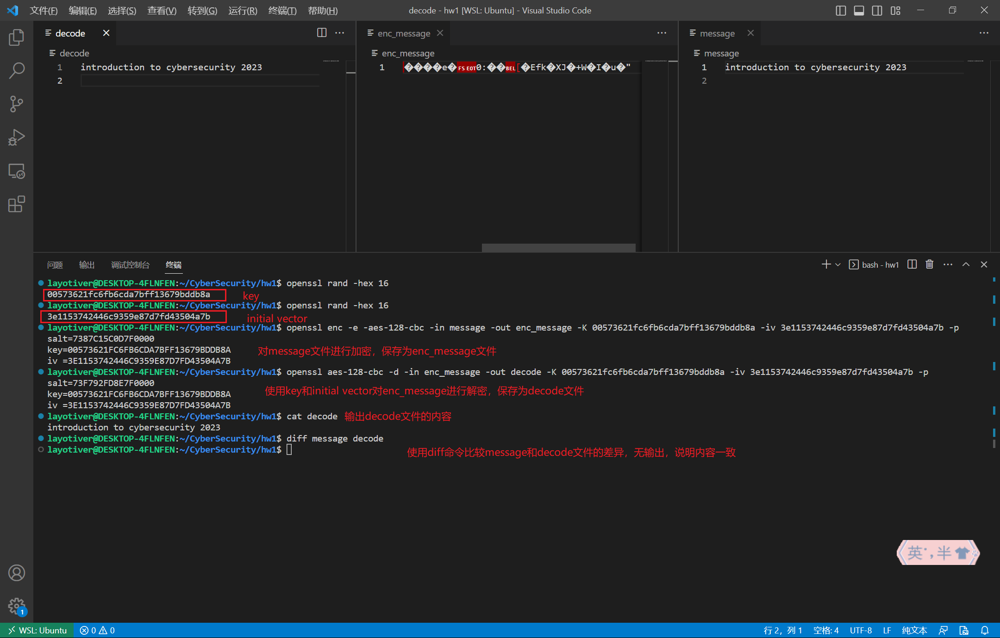
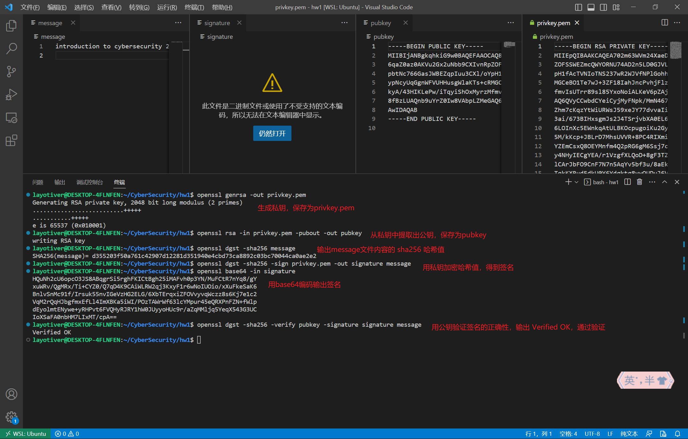

## 5 (30 points) Encrypt/Decrypt/Sign through openssl

### (a) and (b)

1. 使用 `openssl rand -hex 16` 命令生成16字节的密钥和初始向量，用16进制数表示。
2. 使用 `openssl enc -e -aes-128-cbc` 加密message文件，得到enc_message文件
3. 使用 `openssl aes-128-cbc -d` 命令解密enc_message文件，得到decode文件
4. 输出decode文件的内容，内容正确。比较decode和message的内容，内容一致

### (c), (d), and (e)

1. 使用 `openssl genrsa` 命令生成私钥
2. 使用 `openssl rsa` 命令从私钥中提取出公钥
3. 使用 `openssl dgst -sha256` 命令生成message文件的sha256 哈希值
4. 使用 `openssl dgst -sha256 -sign` 命令用私钥加密哈希值，得到签名，保存为signature文件
5. 使用 `openssl base64` 命令用base64编码输出signature文件
6. 使用 `openssl dgst -sha256 -verify` 命令验证签名，输出Verified OK，通过验证