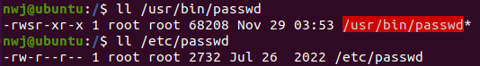
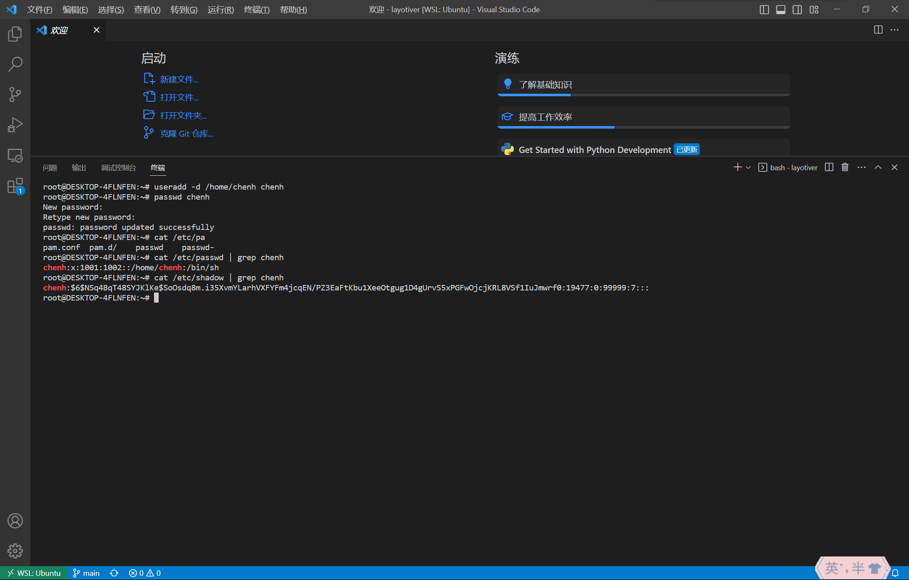
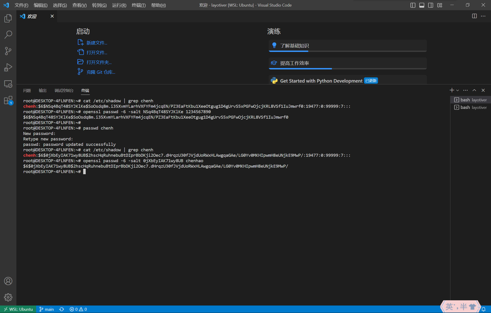

<script type="text/javascript" src="http://cdn.mathjax.org/mathjax/latest/MathJax.js?config=TeX-AMS-MML_HTMLorMML"></script>
<script type="text/x-mathjax-config">
    MathJax.Hub.Config({ tex2jax: {inlineMath: [['$', '$']]}, messageStyle: "none" });
</script>

# Homework 2
Edited by
牛午甲 PB20111656
潘云石 PB20111657
石磊鑫 PB20111658
孙霄鹍 PB20111659
陈&nbsp;&nbsp;&nbsp;&nbsp;昊 PB20051077

## T1
1. 新进程具有与父进程相同的 `euid`、`ruid` 和 `suid`，故新进程 `uid` 也是 x.
   > When a process is created by fork, it inherits the three user IDs from its parent process.
2. - 此场景下进程没有 root 权限。如果系统调用 `setuid(uid)` 中参数 `uid` 等于该进程的 `ruid` or `suid` m，则把 `euid` 设为 m，`ruid` 和 `suid` 都不变；如果系统调用 `setuid(uid)` 中参数 `uid` 等于该进程的 `euid` y，则 `euid`、 `ruid` 和 `suid` 都不变；否则返回错误。
   - 此场景下进程有 root 权限。ruid，euid，suid 都修改为系统调用 `setuid(uid)` 中参数 `uid` 的值。
    > **early Unix systems**: if the effective uid was zero, setuid set both the real uid and effective uid; otherwise, setuid could only set the effective uid to the real uid.
    > **System V** modified setuid so that if the effective uid was not zero, setuid functioned as seteuid (changing only the effective uid); otherwise, setuid set all three user IDs.
    > **BSD** setuid set all three user IDs regardless of whether the effective uid of a process was zero.
3. - Isolation：可以更好地隔离应用程序之间的关系。如果一个应用程序被攻击或感染，它将不能访问或影响其他应用程序的数据或资源。例如 memory protection 机制、进程间通信仅限于使用 Unix domain sockets、只有 root 用户可以 ping, zygote（派生其他进程）；
   - Permissions：Android 可以根据应用程序的 uid 授予或拒绝特定的权限，从而更细粒度地控制每个应用程序可以访问的资源。
   - Resource allocation：通过为每个应用程序分配唯一的 uid，Android 可以限制每个应用程序使用的资源，防止任何一个应用程序独占系统资源。
4. - 当 Android Zygote 进程创建新进程时，新进程会继承 Zygote 进程的 `uid`，通常为 root 用户。
   - 出于安全考虑，需要通过调用 `setuid()` 函数降低新进程的特权。通常将进程的 `euid` 设置为应用程序的 `euid`，使其只能访问该应用程序可访问的资源。这有助于实施最小权限原则 (Least	Privilege)。通过以较低的权限运行进程，潜在的安全漏洞或攻击的影响被限制在进程可以访问的资源范围内。例如，如果应用程序进程被攻击，它只能访问应用程序被授权访问的资源，而不能访问整个系统。
5. - 应该在 passwd 程序中设置 setuid 位(这样 `euid` 就被设置为文件所有者的 `uid`，即 root)。当 passwd 程序上设置 setuid 位时，这意味着该程序以文件所有者（在本例中为 root）的权限而不是运行程序的用户的权限执行。这允许普通用户通过运行 passwd 程序写入密码文件（这通常只有 root 用户才能写入）。
   - 在程序中设置 setuid 位可能会存在安全风险，因为该程序将以更高的权限执行。为了最小化这种风险，passwd 程序应仔细编写和审查，以确保它不包含任何可能被攻击者利用的安全漏洞。此外，密码文件本身也应受到适当的保护，以防止未经授权的访问。
   - 在 Linux 下尝试如下：
    
    `setuid` 的作用是：让执行该文件的用户以该文件拥有者的身份去执行。即普通用户执行 `/usr/bin/passwd` 时，拥有 root 的权限。这样就可以修改 `/etc/passwd` 了。它的标志为：`s`，会出现在 `x` 的地方，如 `rwsr-xr-x`，用户必须拥有执行权限。[参考博客](https://blog.csdn.net/dongyanxia1000/article/details/53183254)
   
## T2
总时间为 $$\frac{95^{10}}{6400000}s\approx 296653\ years$$

## T3
1. 当作为 setuid root 程序运行时，代码存在潜在的安全问题。考虑符号链接攻击：攻击者先创建了一个名为 `file.dat` 的符号链接。在执行 `stat()` 函数时，会检查符号链接而非实际的文件，并报告该文件不存在，因为符号链接并没有指向一个名为 `file.dat` 的实际文件。当程序休眠时，攻击者将 `file.dat` 指向一个敏感文件或目录，比如 `/etc/passwd`。因此，程序将在 `sleep()` 函数调用之后，继续创建一个具有相同名称和权限的文件（比如 `/etc/passwd`）。由于程序正在以 root 权限运行，所创建的新文件将被 root 拥有，并可能被用于覆盖或修改系统上的敏感文件。此例中程序会在攻击者链接到的敏感文件中写入 `Hello world!`。
2. 从代码中删除 `sleep(10)` 不会防止（a）中的安全问题发生。即使删除了 `sleep()` 调用，攻击者仍然可以在 `stat()` 调用后但在 `fopen()` 调用之前创建符号链接，导致程序创建具有错误权限或内容的文件。这是因为操作系统在进程之间需要不断地进行上下文切换，导致存在被攻击的可能。
3. 将文件存在检查、文件打开/写入作为原子操作。具体地在执行文件存在性检查之前加锁，锁定对文件句柄的访问；在完成写操作之后取消此锁。

## T4
1. salt 是一个随机数。使用 salt，在 Dictionary attack 场景中攻击者必须为字典中的每个单词尝试所有的 salt 值。（例如一个12 bits 的 random salt，同一个 password 可能被 hash 到 $2^{12}$ 不同的值）salt 的主要作用是在有人得到 `/etc/shadow` 文件时更好地保护密码。salt 机制可以使相同的 password 明文被 hash 到不同的值，可防止攻击者制作已知密码的彩虹表，大大增加了字典攻击的计算开销。
2. 虽然增加盐值大小可以使密码破解更加困难，但它不能完全挫败所有密码破解者。增加盐值大小会使攻击者使用彩虹表来破解密码更加困难。然而，具有足够计算资源的攻击者仍然可以使用字典攻击来破解密码，尽管速度较慢。此外，增加盐值大小会增加存储盐值的存储要求，并可能影响密码散列算法的性能，因此在具有有限存储或处理能力的某些系统中，依靠增加盐值大小提高安全性是不可行的。

## T5


## T6


### a
使用 `useradd -d /home/chenh chenh` 命令创建一个用户名为 `chenh` 的用户，指定家目录为 `/home/chenh`。
使用 `passwd chenh` 命令设置 `chenh` 的密码，输入两次密码即可设置成功，这里设置密码为1234567890。输入密码时，密码并不会在屏幕上回显。

### b
使用 `cat /etc/passwd | grep chenh` 命令和 `cat /etc/shadow | grep chenh` 命令分别可以查看 `/etc/passwd` 和 `/etc/shadow` 文件里有关chenh的条目

其中 `/etc/shadow` 文件里有关chenh的内容为

```
chenh:$6$NSq4BqT48SYJKlKe$SoOsdq8m.i35XvmYLarhVXFYFm4jcqEN/PZ3EaFtKbu1XeeOtgug1D4gUrvS5xPGFwOjcjKRL8VSf1IuJmwrf0:19477:0:99999:7:::
```



### c
根据[这篇文章](https://linuxize.com/post/etc-shadow-file/)的介绍。The password is using the `$type$salt$hashed` format.
其中 `$6$` 代表 SHA-512算法。由此可得

salt: NSq4BqT48SYJKlKe
the salted password hash: SoOsdq8m.i35XvmYLarhVXFYFm4jcqEN/PZ3EaFtKbu1XeeOtgug1D4gUrvS5xPGFwOjcjKRL8VSf1IuJmwrf0
the hash algorithm: SHA-512

### d
使用 `openssl passwd -6 -salt NSq4BqT48SYJKlKe 1234567890` 命令，可以得到密码 `1234567890` 的sha512散列值，对比可以发现跟 `/etc/shadow` 文件里的一致

### e
这里我们再次使用 `passwd chenh` 命令设置chenh的新密码，设置为 `chenhao`。通过查看 `/etc/shadow` 文件里的条目，可知

salt: 0jXbEyIAK71wy8UB
the salted password hash: 2hscHqRuhnebuBtDIprBbDKji2Oec7.dHrqzU30fJVjdUoRWxHLAwgqaGAe/LG0Yv0MKHIpwmH8eUNjkE9MwP/
the hash algorithm: SHA-512

使用 `openssl passwd -6 -salt 0jXbEyIAK71wy8UB chenhao` 命令，可以得到密码 `chenhao` 的sha512散列值，对比可以发现跟 `/etc/shadow` 文件里的一致

## T7 The Security Architecture of the Chromium Browser
### Summerize
- 主要贡献：提出了模块化的浏览器架构，设计并实现了Chromium。
- 核心思想：将浏览器分为两个保护域，分别为浏览器内核和渲染引擎，通过sandbox使渲染引擎无法直接访问用户的文件系统，这样即使更容易被攻击的渲染引擎被攻击者控制也不会对用户造成很大的危害，增加安全性。
#### 单片浏览器的缺点：
- 一个应用的崩溃会影响其他的应用。
- 单片浏览器在单一的保护域中运行，攻击者可以利用未修补的漏洞危及整个网络。
#### 其他模块化浏览器的缺点
- 牺牲与一些网站的兼容性来提供架构隔离，用户体验不好。
#### 设计选择
- 浏览器结构必须与现在的网络兼容。
- 浏览器架构将渲染引擎视为黑盒。
#### 攻击模型
认为攻击者已经得知用户浏览器中未修补的漏洞，且能够使用户浏览器呈现恶意内容。
需要达到的主要目标：
- 阻止攻击者向用户设备植入恶意软件
- 使攻击者不能够监测用户的键盘输入
- 阻止攻击者读取用户硬盘中的文件
#### Chromium架构
具有模块化结构，浏览器核心模块在用户端，渲染引擎模块在网络端，中间有sandbox阻隔，减少渲染引擎能够控制的部分。因此即使攻击者可以控制整个渲染引擎，sandbox也能阻止攻击者对用户的文件系统进行破坏。
- 渲染引擎：为DOM调用提供服务，解释和执行web内容，执行同源策略。运行在sandbox中，使其不能直接访问设备操作系统。渲染引擎通过浏览器内核来检索网络中的url。
- 浏览器内核：联系渲染引擎和操作系统，存储用户密码数据库等隐私内容，实现内核API。
- sandbox：阻止渲染引擎的某些对操作系统的请求来阻止攻击者对用户设备的攻击。具体实现为使渲染引擎使用受限制的安全令牌运行。当渲染引擎想要访问一个“secure object”，windows安全管理器检查其是否有这个权限。
- 其他功能：
  - 插件：插件运行在sandbox之外并且拥有用户的所有权限，这种设计可以让插件兼容性更好，但是攻击者可以利用插件中的漏洞进行攻击，在用户的设备中植入恶意软件。
  - 下载和上传文件时渲染引擎可以访问文件系统。

### Critical Reviews

#### Pros
- 提出了开创性的浏览器架构，兼顾安全性和用户体验。
- 通过将渲染引擎视为blackbox减少浏览器内核的复杂度。

#### Cons
- sandbox对于一些使用FAT32文件系统的USB设备失效，使攻击者可能直接读取其存储的内容。
- 因为插件能够拥有所有的权限，攻击者可能通过用户使用的插件中的漏洞进行攻击，进而读取或者修改用户的文件系统。
- 对于不同的渲染任务使用不同的渲染引擎实例，使内存占用比较大。