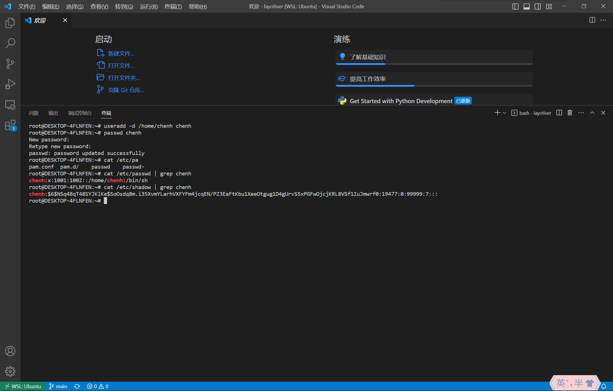
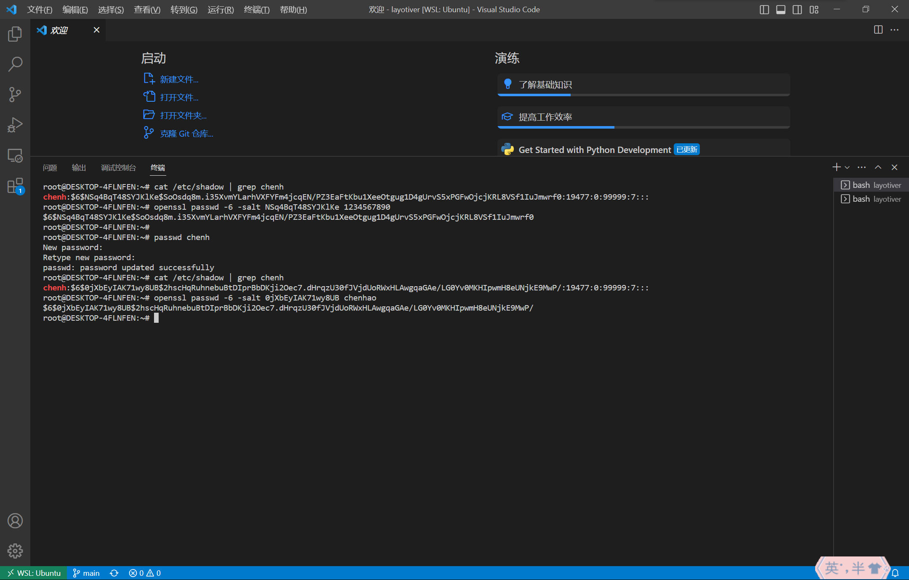

## T6 A lab to understand user/password management on Unix/Linux



### a
使用 `useradd -d /home/chenh chenh` 命令创建一个用户名为 `chenh` 的用户，指定家目录为 `/home/chenh`。
使用 `passwd chenh` 命令设置 `chenh` 的密码，输入两次密码即可设置成功，这里设置密码为1234567890。输入密码时，密码并不会在屏幕上回显。

### b
使用 `cat /etc/passwd | grep chenh` 命令和 `cat /etc/shadow | grep chenh` 命令分别可以查看 `/etc/passwd` 和 `/etc/shadow` 文件里有关chenh的条目

其中 `/etc/shadow` 文件里有关chenh的内容为

```
chenh:$6$NSq4BqT48SYJKlKe$SoOsdq8m.i35XvmYLarhVXFYFm4jcqEN/PZ3EaFtKbu1XeeOtgug1D4gUrvS5xPGFwOjcjKRL8VSf1IuJmwrf0:19477:0:99999:7:::
```



### c
根据[这篇文章](https://linuxize.com/post/etc-shadow-file/)的介绍。The password is using the `$type$salt$hashed` format.
其中 `$6$` 代表 SHA-512算法。由此可得

salt: NSq4BqT48SYJKlKe
the salted password hash: SoOsdq8m.i35XvmYLarhVXFYFm4jcqEN/PZ3EaFtKbu1XeeOtgug1D4gUrvS5xPGFwOjcjKRL8VSf1IuJmwrf0
the hash algorithm: SHA-512

### d
使用 `openssl passwd -6 -salt NSq4BqT48SYJKlKe 1234567890` 命令，可以得到密码 `1234567890` 的sha512散列值，对比可以发现跟 `/etc/shadow` 文件里的一致

### e
这里我们再次使用 `passwd chenh` 命令设置chenh的新密码，设置为 `chenhao`。通过查看 `/etc/shadow` 文件里的条目，可知

salt: 0jXbEyIAK71wy8UB
the salted password hash: 2hscHqRuhnebuBtDIprBbDKji2Oec7.dHrqzU30fJVjdUoRWxHLAwgqaGAe/LG0Yv0MKHIpwmH8eUNjkE9MwP/
the hash algorithm: SHA-512

使用 `openssl passwd -6 -salt 0jXbEyIAK71wy8UB chenhao` 命令，可以得到密码 `chenhao` 的sha512散列值，对比可以发现跟 `/etc/shadow` 文件里的一致