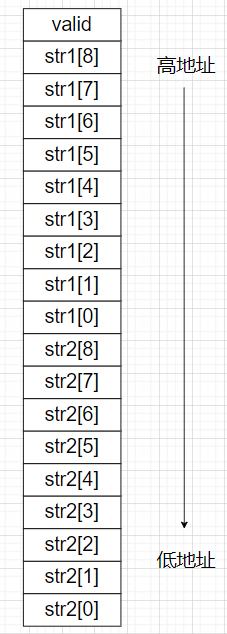

<script type="text/javascript" src="http://cdn.mathjax.org/mathjax/latest/MathJax.js?config=TeX-AMS-MML_HTMLorMML"></script>
<script type="text/x-mathjax-config">
    MathJax.Hub.Config({ tex2jax: {inlineMath: [['$', '$']]}, messageStyle: "none" });
</script>

# Homework 4
Edited by
牛午甲 PB20111656
潘云石 PB20111657
石磊鑫 PB20111658
孙霄鹍 PB20111659
陈&nbsp;&nbsp;&nbsp;&nbsp;昊 PB20051077

## T1
1. NOP Sled 是机器代码中的一串 NOP 指令，执行时不做任何事情 (除了推进 EIP)。链接一长串 nop 意味着在其中的任何地方开始执行都会将 EIP 推进到 shellcode。
2. 在缓冲区溢出攻击中，这是一个确定攻击者想要执行的代码的起始地址的机制。由于堆栈随机化和其他运行时的差异可能使程序跳转的地址无法预测，所以攻击者在很大的内存范围内放置一个 NOP Sled。如果程序跳转到 NOP Sled 的任何地方，它将运行所有剩余的 NOP，什么也不做，然后将运行旁边的有效代码。攻击者使用 NOP Sled 的原因是为了使目标地址更大：代码可以跳到 Sled 的任何地方，而不是正好在注入代码的开头。

## T2
可能的攻击方法：
- 执行远程代码：Shellcode 可能被设计用于利用目标系统中的漏洞，从而获得未经授权的远程访问。攻击者设置一个监听服务，当连接到时启动一个远程 shell，并创建一个反向 shell 连接 hacker，使用建立 shell 的本地漏洞刷新目前阻止其他攻击的防火墙规则。
- 提升权限：Shellcode可能可以提升攻击者在被入侵系统上的权限，使其能够获得管理员或 root 级别访问权限。
- 收集数据：Shellcode 可能被设计用于从目标系统收集敏感信息。这可以包括收集凭据、按键记录、网络流量、系统配置或文件等。收集的数据可以被发送到攻击者的控制服务器。
- 拒绝服务攻击（DoS）：Shellcode 可以用于发动DoS攻击，使目标系统或网络对合法用户不可用。可以通过利用导致资源耗尽的方法或通过向目标系统发送过多的请求来实现这一目标。
- 操作网络设置：Shellcode可以操纵被入侵系统的网络设置，例如创建反向 Shell 以建立与攻击者机器的命令通道，以及端口扫描、网络侦察或在网络中的其他系统之间进行枢纽转移。

## T3
- 攻击步骤：
  1. 运行程序，在输入中输入`abcdefghiabcdefghi\n`
  2. 由于使用`gets`，不会进行缓冲区溢出检查，会覆盖`str1`中的内容，使得`str1`中的内容和`str2`中的内容相同，这样就算不知道密码也可以登录。注：由于临时变量存储在 stack 中，并且从高地址向低地址生长，因此后定义的`str2`起始地址比`str1`的起始地址低，具体见图：
    
    ```sh
    Input your password:
    abcdefghiabcdefghi
    Your exploit succeeds!
    buffer1: str1(abcdefghi), str2(abcdefghiabcdefghi), valid(1)
    ```
- 为了防止攻击者通过这种方式进行攻击，可以将`gets`改为`fgets`指定可以读取的位数，这样就可以避免上述安全问题。

## T4
初始状态内存设置如下：
| Address | Value  |
| ------- | ------ |
| 0x9000  | 0x3333 |
| 0x9004  | 0x5000 |
| 0x9008  | 0x4000 |
| 0x900c  | 0x6666 |
| 0x9010  | 0x6000 |
| 0x9014  |        |

初始状态寄存器设置如下：
| Register | Value  |
| -------- | ------ |
| ecx      | 0x3000 |
| edx      | 0x899c |
| eip      | 0x4000 |

## T5
```c
uint32_t nlen, vlen; 
char buf[8264];
```
这里将`nlen`，`vlen`定义为`unsigned int`类型。
```c
nlen = 8192;
if ( hdr->nlen <= 8192 ){
 nlen = hdr->nlen; 
}
memcpy(buf, hdr->ndata, nlen); 
buf[nlen] = ':';
```
这段代码检测```hdr->nlen```是否超过8192，若未超过则将其赋值给```nlen```并将```buf```中的```nlen```区域大小的位置分配给```hdr->ndata```。
```c
vlen = hdr->vlen;
if (8192 - (nlen+1) <= vlen ){ /* DANGER */
 vlen = 8192 - (nlen+1);
}
memcpy(&buf[nlen+1], hdr->vdata, vlen);
buf[nlen + vlen + 1] = 0;
```
这段代码检测剩余的空间大小是否小于`vlen`，若小于则将`vlen`变为剩余空间的大小`8192 - (nlen+1)`并将`hdr->vdata`拷贝到这块空间中。
- 若此时`nlen=8192`，则`vlen`会等于-1，由于其为`unsigned`类型，则其值`0xffffffff`会被解释成4294967295。将其用于`memset`参数会导致缓冲区的溢出。
- 由于攻击者可以控制`hdr`，则只需将`hdr->nlen`设置为8192，且将`hdr->vlen`设置为大于0的值，即会导致缓冲区溢出。

## T6 
###  Ostia: A Delegating Architecture for Secure System Call Interposition
1. 应用沙盒提供了受限执行环境，限制应用程序对敏感操作系统资源的访问。虽然有多种构建这些系统的机制被提出，实施和研究最为彻底的方法是基于系统调用拦截的方法。本文介绍了由作者几人研究的沙盒Ostia，它基于一种全新的“委派(Delegating)”架构，并与当今常用的“过滤”架构进行了比较。我们介绍了每种架构的显著特点，并研究了对安全性、兼容性、灵活性、可部署性和性能等方面有显著影响的设计选择。
2. 对于沙盒的设计，可分为纯用户级、纯操作系统级以及混合级：
   1. 纯用户级沙盒可以藉由软件隔离技术（如基于软件的故障隔离、程序引导、软件动态转换和安全语言等）实现。这些技术在用户级执行策略强制执行，无需修改操作系统内核即可实现卓越的可扩展性。这些方法存在一些限制：
      1. 特定性限制：安全语言（如Java）和低级软件隔离技术（如SFI）通常对特定的API或ABI非常具体，严重限制了它们所支持的语言和架构范围。
      2. 复杂性和保证性：相比较简单的硬件隔离机制，软件隔离机制的复杂性提供的保证较少。这意味着软件隔离机制的可信度较低。
      3. 程序执行开销：这些软件隔离机制通常会给程序执行带来一定的开销，即执行速度变慢。
   2. 基于操作系统的隔离机制完全依赖硬件内存保护实现隔离。并且标准操作系统已经提供了这种基于操作系统的隔离机制。
      1. 其优点在于基于操作系统的隔离不依赖软件的内部API或ABI，并且速度快
      2. 缺点是沙盒系统对内核来说仍然是一个复杂的附加组件，现代单体内核中的内部接口的大小和复杂性对沙盒隔离的正确性产生很大的挑战。内核内部的不规则和动态性质也极大地加剧了可移植性、审计和代码维护的问题。
   3. 混合沙盒系统，其内核级代码可利用操作系统的隔离机制，并提供基本的执行机制，其余部分位于用户级。与纯用户级解决方案相比，利用操作系统内核提供的硬件内存保护可以获得更高的保证、更好的兼容性.
3. 前人对于混合介入式沙盒的实现架构主要是由Janus等人设计的基于过滤器（filter）的实现，在它由两部分组成：基于内核的跟踪机制，用于过滤沙盒应用程序的系统调用，以及用户级别的“监视器”，根据用户指定的策略告诉跟踪接口哪些调用应该被允许或拒绝。在过滤沙盒中，当沙盒化进程（“客户端”）执行敏感调用时，进程跟踪机制将其置于休眠状态并向监视器发送请求。监视器根据策略引擎的判断回复请求。然后，跟踪机制唤醒沙盒化进程。如果调用被允许，客户端的调用将正常执行。如果调用被拒绝，调用将立即返回错误代码。
4. 作者阐述了基于过滤的的沙盒存在一个重要问题：竞态条件。这是由于其架构的本质特点导致的,可分为几种竞态：
   1. 当进程中的线程共享单个文件描述符表时，描述符编号引用的对象在检查和使用之间可以发生变化。同样，如果两个线程共享当前工作目录，那么在检查和使用之间，第二个线程可以更改线程的当前工作目录。在过滤沙盒中似乎没有任何简单的方法来解决这些竞态条件。
   2. 共享内存（线程间和进程间）会导致参数竞态条件，即参数在策略引擎检查之后但在系统调用使用之前可能发生变化的竞态条件
   3. 文件系统中的全局共享状态产生的竞态条件。这些竞态条件分为两类：符号链接竞态条件和相对路径竞态条件.符号链接竞态条件是由于路径中的任何组件在检查和使用之间可能被符号链接替换而引起的;相对路径竞态条件是文件系统竞态条件的第二种类型，当进程的当前工作目录的父目录发生变化并且正在使用相对路径时会发生.
   4. 对于以上的问题，任何过滤式沙盒都没有有效或高效的解决方法
5. 作者等人放弃使用过滤式，提出了全新的基于委派的沙盒架构，它由三个主要部分组成：
   1. 内核模块：执行硬编码策略，阻止所有直接访问敏感资源（例如open、socket）的调用，并提供了一个跳板机制，将委托的调用重定向回仿真库。
   2. 仿真库（Emulation library）：使用内核模块中的回调机制来重定向系统调用。当敏感的系统调用到达内核入口点时，仿真库将系统调用转换为对代理（Agent）的请求。为了加速代码中相同位置的后续系统调用，处理程序还会检查调用所在的机器指令，并且如果指令符合预期的形式，则在原地修补指令，直接跳转到处理程序，避免了通过内核的多次往返。
   3. 代理（Agent）:代理（Agents）是负责读取策略文件、启动初始沙盒进程、进行策略决策等任务的组件。每个沙盒进程都有自己的代理。代理向其沙盒进程提供的最重要功能是处理对仿真库的调用请求。系统调用可以分为三类：必须委派的调用、总是允许的调用和完全禁止的调用。
6. 当客户端进行敏感系统调用时，它被重定向到仿真库，后者通过IPC通道向其代理发送请求。如果策略允许该请求，代理将访问所请求的资源（可能执行一个或多个系统调用）并将结果（例如返回代码、描述符）返回给客户端。与过滤沙盒类似，只是使用客户端已经获取的资源（例如read、write）而不提供对敏感资源的访问的调用将由客户端直接执行。
在委派沙盒中，代理既检查权限又代表子进程访问请求的资源，这是代理与过滤沙盒中的监视器最重要的区别。委派沙盒之所以得名，是因为访问敏感资源的能力被从客户端中撤销，并委托给代理。
1. 基于委派可以改善竞态条件：单独使用委托并不能防止所有的竞态条件。然而，它可以通过默认将进程间/线程间状态置于代理的控制下，防止一些竞态条件的发生。同时，委托机制也方便了通过让代理控制资源访问的方式来预防剩余的竞态条件：
   1. 线程间和进程间共享状态竞态条件： 在委派式沙盒中，敏感的系统调用由代理执行，因此敏感系统调用使用的文件描述符空间、当前工作目录等状态被代理独占。大多数竞态条件，如参数竞态条件，不再是一个问题，因为外部进程无法修改这些状态。
   2. 全局共享状态：从某种意义上说，过滤式沙盒面临的主要问题是它们无法控制程序如何访问资源。在委托式沙盒中，我们可以解决这个问题，因为沙盒自己执行对资源的所有访问。因此，访问可以按照尊重操作系统提供的在文件系统上提供无竞态操作的约定的方式进行。另一种观点是，代理是一个主动的代理，它规范调用操作系统，使其以可预测的结果形式提供。
2. 作者又基于过滤式架构实现了过滤式沙盒J2（janus version 2），与文章的主要实现的委派沙盒Ostia进行了各方面的对比：
   1. 代码复杂性：要总结一个系统的安全性并不简单。一个常见的比较起点是代码行数。
      1. 首先，考虑用户级代码。Ostia代理总共有3,200行代码。其中，策略引擎占700行，其余的2,500行是系统核心代码。J2监视器实际上有3,000行代码（策略引擎占1,400行，核心代码占1,600行，还有额外的1,000行用于策略调试中的系统调用的日志打印）。因此，这两个系统的用户级部分大小几乎没有差异，也与最初的Janus原型相差不大，Janus原型只有不到3,000行代码。Ostia仿真库额外有1,000行代码，但它不是受信任计算基（TCB）的一部分，因为它运行在不受信任应用程序的地址空间中。
      2. J2内核模块mod janus由1,400行C代码和11行x86汇编代码组成。Ostia内核模块mod ostia只有200行C代码和5行x86汇编代码。J2和Ostia内核部分的复杂性差异指出了每个工具对系统安全性的影响存在显著差异。内核bug可能使整个系统变得容易受到攻击，而用户空间部分的bug通常只会使沙盒失效。
   2. 可扩展性和灵活性：
      1. 委托架构为轻松支持新政策提供了扩展的潜力。 更具体地说，因为 Ostia 在用户级别处理授予对资源的访问权限，所以改变系统调用的实现本质上更容易。 这种增加的灵活性可以在各种场景中带来好处。
      2. 过滤沙箱为更改调用实现提供了一些支持。 例如，有些支持重写参数、更改调用的返回值或在执行系统调用时更改进程的特权级别的能力，然而，对于调用执行方式的每一次新更改，都必须逐步向内核添加新的支持。委托沙箱很容易在用户级别完全容纳所有这些功能，因为Agent完全控制了调用的执行环境（例如调用参数、特权级别、描述符空间）
   3. 兼容性
      1. 出于实用性，应用程序沙箱必须与广泛的软件兼容。这要求不能重新编译或以其他方式修改应用程序来实现在沙箱中运行。 Ostia 以及许多过滤沙箱都符合这一标准。Ostia 还支持多线程应用程序。 由于竞争条件的问题，没有过滤沙箱系统支持多线程应用程序。
   4. 易部署性：
      1. 程序的先决条件和依赖越少，就越容易部署到实际系统中。Ostia依赖于内核模块，这本身就造成了一些部署困难，因为它要求安装它的任何机器都有C编译器和适当的头文件，或者合适的预编译模块。Ostia的模块非常简单，对内核内部的依赖很少，这使得移植和维护变得容易。
      2. 另一方面，许多过滤沙箱(包括J2)所需的内核模块更大、更复杂，对内核内部有重要的依赖，可能需要随着内核的发展而仔细更改，这使得移植和维护变得更加困难。Ostia不需要内核补丁，大大减轻了安装程序的负担。
   5. 性能开销，在作者的运行的平台上：
      1. 相较于无沙盒执行geteuid指令，J2运行时间为9倍，Ostia运行时间为12倍。相较于无沙盒执行open指令，J2运行时间为5倍，Ostia运行时间为8倍。作者将执行open的过程分解，发现 Ostia 的策略引擎比 J2 的慢。 这是因为 Ostia 的策略引擎经常进行多个系统调用，而用于文件系统操作的 J2 策略引擎主要是字符串匹配操作。 该表还显示 Ostia 具有更高的“额外”内核开销，这可能是由于进程间文件描述符的传递造成。
      2. 在web serving，decompress, encode, build四个过程，J2与Ostia的运行时间相差无几
      3. 打开和关闭 1,000,000 个文件的时间。 “No.Procs”是文件操作在每一行中被划分的进程数,当该数值为1时，Ostia运行时间为J2的1.5倍;当该数值为25时，Ostia运行时间为J2的1.1倍;当该数值为50时，Ostia运行时间为J2的0.6倍;当该数值为001时，Ostia运行时间为J2的0.08倍.
3. 总结：文章探讨了系统架构在介入式系统中的重要性。 我们介绍了两个实现不同混合架构的系统：J2，基于代表当今许多沙盒系统的“过滤”架构，以及基于新颖的“委托门控”架构的 Ostia。 可以观察到，当今过滤架构中的许多问题都可以通过基于委托的方法得到改善。 此外，委托方法可以增强现有混合方法的各种有益特性。
