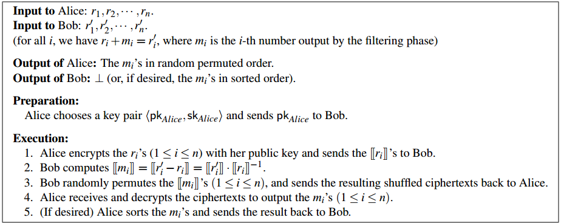

# Are garbled circuits better than custom protocols
注：在这篇文章中，universe 是集合中元素可能取值的全集，n 是集合的大小。
## Introduction
- 使用 Yao’s generic garbled circuit 来执行 PSI。
- 使用通用技术生成隐私保护协议有几个优点
  - 通过依赖现有的软件包来构建乱码电路协议，人们只需要为要计算的功能编写一个电路，而不必从头开始设计和实现一个新的协议。
  - 通用协议本身也比定制协议更加模块化。

- Threat model：semi-honest
- baseline：De Cristofaro and G. Tsudik. Practical private set intersection protocols with linear complexity (2010)

## Background
### PSI
### Garbled circuits
在一个 garbled-circuit 协议中，一方 (the circuit generator) 生成一个计算函数 $f$ 的解密版本，另一方 (the circuit evaluator) 在不学习任何中间值的情况下计算输出

若干优化：
- free-XOR 技术允许电路中 $f$ 的 XOR 门求值，而不需要任何通信或加密操作。
- 使用了 oblivious transfer extension，它以 $k$ 个 OT 为代价实现了无限数量的 OT，其中 $k$ 是一个(统计)安全参数。

## Bitwise-AND Protocol
- 适用场景：universe 很小
- 主要思想：集合可以用一个长为 $2^\sigma$ 的0-1向量表示，集合的交集可以通过对双方的0-1向量进行按位与来计算。输出恰好是交集的0-1向量表示。
- 计算电路：$2^\sigma$ 个二进制与门即可。
- 缺点
  - 最终协议的开销随着 $\sigma$ 呈指数增长。
  - BWA 协议不限制各方集合的大小，因此不诚实的参与者可以使用全1向量作为输入，从而了解其他参与者的整个集合。

## Pairwise Comparisons
- PWC 时间复杂度：$O(\sigma n^2)$
- 只有判断相等的`Equal`函数需要 garbled circuit 实现。具体地将两个 $\sigma$ bits 的输入按位异或，在将所有位求位或即可。
- 算法会在找到匹配项后立即显示匹配项
  优点：
  这可以提高性能，避免对任何已经匹配的元素执行进一步的比较。
  > 性能提升的理论分析：设集合 $S$ 和 $S'$ 大小都是 $n$，交集的大小为 $\hat{n}$，由于 $S$ 和 $S'$ 是随机排列的，所以这 $\hat{n}$ 个相交元素期望分布是均匀的，将集合划分为 $\hat{n}+1$ 个区间，每个区间有 $\frac{n-\hat{n}}{\hat{n}+1}$ 个元素，对于第 $i(0\le i\le \hat{n})$ 个区间中的每个元素，都要执行 $n-i$ 次比较；对于第 $i(0\le i\le \hat{n}-1)$ 个相交的元素，平均意义下需要执行 $\frac{n-i}{2}$ 次比较。因此，总共比较次数：
  $$\begin{aligned}
    N_{Equal}\approx \sum_{i=0}^{\hat{n}}\frac{(n-\hat{n})(n-i)}{\hat{n}+1}+\sum_{i=0}^{\hat{n}-1}\frac{n-i}{2}=\frac{(2n-\hat{n})^2+\hat{n}}{4}.
  \end{aligned}$$
  
  缺点：
  - 可能会泄露有关各方集合中元素的位置信息，因为参与方了解找到匹配元素的顺序。解决方法是**各方在开始协议之前随机排列其集合**。
  - 大大增加了通信复杂度，因为每个 reveal 操作都增加了额外的一轮通信。解决方法是**使用两个线程实现协议**，其中 reveal 是异步完成的，而主线程比较每个可能的元素对。一旦 reveal 线程找到了匹配项，主线程就会被异步通知跳过涉及匹配元素的所有不必要的比较。

## Sort-Compare-Shuffle
- SCS 时间复杂度：$O(n\log n)$
- 主要思想：每一方都首先对其集合进行本地排序。然后双方实现一个 oblivious merging network，利用两个输入集都已排序的事实，对它们集合的并集进行排序。接下来使用 garbled circuits 来比较排序序列中的相邻元素以找到所有匹配项。但是，**在此阶段直接输出匹配项将揭示不在交集中的元素的信息**。(例如，如果双方得知排序列表中的前两个元素匹配，这将向第一方透露，第二方的集合不包含任何小于第一个匹配元素的元素) 因此需要对匹配元素的列表进行洗牌，这样就不会显示匹配元素的位置。

### Sorting
- 使用 garbled circuit 进行 oblivious sorting 的挑战在于，**排序必须由使用固定的比较序列的排序算法来完成**。最常用的排序算法并不能产生最优电路，**排序网络**提供了一种快速的排序电路实现。
- 改进优化：
  1. 将排序网络中基本模块 $2-Sorter$ 的 non-free binary gates 减少了一半。
  2. 由于每个集合会预先排序，因此使用 bitonic merger 代替了完整的排序网络。

### Filtering Matching Elements
- 主要思想：当 $2n$ 个元素都按顺序排列后，交集中的任何元素都必须是相邻的。使用 DupSelect-2 电路进行相邻元素两两比较即可。
  > DupSelect-2 电路：输入两个 $\sigma-bit$ 的 $x_1,x_2$，如果 $x_1=x_2$ 输出 $x_1(=x_2)$；否则输出 $0^\sigma$。
- 改进优化：由于先前假设两方各自的集合中没有重复元素，因此在合并后的集合中每相邻3个元素至多只有一对相等。使用 DupSelect-3 电路代替 DupSelect-2，将逻辑门的开销从 $(2\sigma-1)(2n-1)$ 降到 $(3n-1)\sigma-n$，同时减少了输出元素：将 DupSelect-2 产生的 $2n−1$ 个输出元素降到 $n$，这可以显著降低后面 oblivious shuffling 操作的开销。
  > DupSelect-3 电路：输入三个 $\sigma-bit$ 的 $x_1,x_2,x_3$，如果三个数中存在相等的，输出相等的值；否则输出 $0^\sigma$。

### Shuffling
Filtering 之后，得到一个包含 $n$ 个元素的列表，其中包含交集中的所有 $\hat{n}$ 个元素，按从小到大的顺序排列，与 $n−\hat{n}$ 个0交替出现。**这个元素列表不能透露给双方，因为0元素和交集元素的位置可能会泄露双方初始集合的信息**。

#### Sorting
- general strategy：使用 oblivious sorting network 将输出排序（即把所有的 $0^\sigma$ 移到最前面）。
- 如果 $\hat{n}$ 相比于 $n$ 非常小，可以选择使用 $\frac{n}{\hat{n}}$ 次 $2\hat{n}-sorter$，总的逻辑门开销为 $n\log^2(2\hat{n})$。

#### Homomorphic Shuffling
- 具体过程：假设 Filtering 之后 garbled-circuit 计算出 $m_1,m_2,...,m_n$，参与方A事先给 garbled-circuit 提供 $n$ 个随机数 $r_1,r_2,...,r_n$，接下来 garbled-circuit 计算 $r_i'=m_i+r_i$，把计算结果告知参与方B。(此时相当于双方各自持有了计算目标 $m_1,m_2,...,m_n$ 的一个share) 然后双方执行下述基于同态加密的 shuffling 协议：
- 局限性：
  - 虽然这种方法的复杂度在关于 $n$ 是线性的，但是同态加密的计算成本非常高；
  - 这种方法需要同态加密，不符合只使用通用安全计算来实现与其他安全计算轻松集成的初衷。

#### Shuffling Network
- 主要思想：使用 switching network 实现元素的 oblivious random shuffling。
  > switching network 可以看作是一个固定电路，它有 n 个输入和一组额外的“控制位”，每个控制位决定是否交换某些固定的元素对。通过适当地设置控制位，可以实现对 n 个输入的任何期望的排列。
- 具体过程：将 Filtering 之后 garbled-circuit 计算出的 n 个元素当作 switching network 的输入，参与方A选择一个随机排列，然后设置控制位以实现该排列。参与方B接收按照参与方A指定排列下的n个元素。如果参与方A也需要获得交集，参与方B将得到的输出排序后发送给A即可。
- 优势：是一个 pure garbled-circuit 的协议，在大规模的 PSI 场景中性能很高（在较短的安全级别略好，在最高的安全级别明显更好）；
- 不足：比其他 PSI 协议要消耗更多的带宽。
- 最终协议中采用了 Waksman network 作为 switching network 的具体实现。