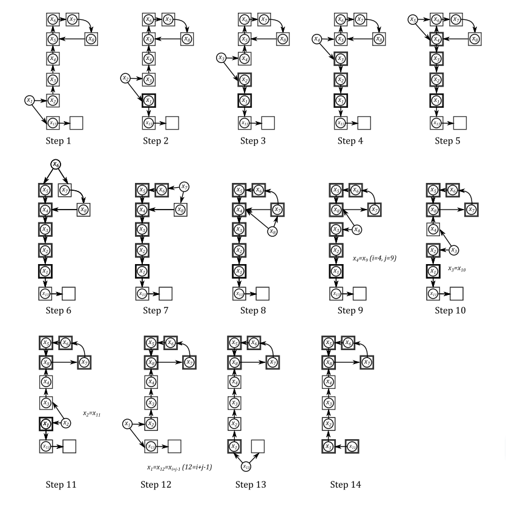

# Cuckoo hashing

### 布谷鸟的行为
1.布谷鸟妈妈从不筑巢，她将自己的蛋生在别的鸟的巢里。
2.新出生的布谷鸟本能地将巢里的其他蛋踢开。
布谷鸟哈希正是仿照布谷鸟的这些行为。

### 插入逻辑
设插入的值为x：
1.若值x已在哈希表中则直接返回。
2.若插入后哈希表空间不足则先进行扩容，再rehash，然后进行3、4、5。
3.用哈希函数$h_1(x)$计算出x应该插入的桶下标$i_1$，若bucket[$i_1$]空则直接插入。
4.若bucket[$i_1$]非空，则将bucket[$i_1$]中的老值$x_{old}$踢开，并用哈希函数$h_2(x_{old})$寻找$x_{old}$应该填的下一个位置。
5.设插入值为$x_{old}$重复2，直到达到最大循环次数（插入失败），或者被踢开的值都找到了新的位置（插入成功）。

### 查找逻辑
使用两个哈希函数$h_1(x)$和$h_2(x)$计算需要查找的值有可能在的两个桶，若没有匹配则查找失败，否则查找成功。

### 运行时间分析
插入的最坏循环次数是常数，插入的摊还时间复杂度为O(1)。
- 当哈希表空间不足时需要进行扩容操作，对于n次插入，需要O(logn)次扩容，每次需要进行重新哈希，大小分别为$n,n/2,···，n/2^{O(logn)}$,所需要的时间为O($n+n/2+···+n/2^{O(logn)}$)$<$O(n+n/2+n/4···)=O(n)。因此对于n个插入操作扩容的摊还时间为O(1)。
- 插入循环分析
设插入x会驱逐y，y插入到新位置会驱逐z···
设这个序列$x_1=x,x_2=y,x_3=z···$为无巢序列。
情况1：无巢序列没有重复的元素，即$x_1\ne x_2\ne x_3···$，这种情况下经过O(1)时间即可结束插入。
情况2：无巢序列中有重复元素：这里假设$x_i$在位置$x_j$被第二次移除，i$<$j，则此时若此位置是由$h_1(x)$所得的，则用$h_2(x)$计算其下个位置，反之亦然。这种情况下，插入过程会回溯$x_i$前面的一系列键，从$x_i=x_j$开始，$x_{i-1}=x_{j+1}···$,直到$x_1=x_{j+i-1}$,这些键都被回退到x未被插入之前的位置(对应图中step9-12)，然后把x放到位置$h_2(x)$,这样插入过程就会继续，直到某个$x_l$被插入一个空的位置$^{[2a]}$，或者$x_l$再次与前面的某个键相同，如果最终陷入死循环，则需要进行重新哈希$^{[2b]}$。

为了进行插入的时间复杂度分析，需要使用如下引理：
##### 引理1：
假设在某步p, x的插入过程产生一个序列$x_1=x,x_2,···,x_p$的无巢键，其中还没有形成闭环(即死循环)。在$x_1,···,x_p$中，存在长度为$l≥p/3$的连续子序列$x_q,x_{q + 1},···,x_{q + l−1}$其中的无巢键各不相同，且其中$x_q = x_1 = x$。

时间复杂度分析：
考虑插入过程产生长度k$\le$2MaxLoop的无巢键序列，会产生以下三种情况：
- 情况1：哈希函数不是随机选则的。这种情况发生的概率为$O(1/n^2)$。
- 情况2：插入过程还未陷入死循环。这种情况发生的概率为$O(2(1+\epsilon)^{-\frac{k-1}{3}+1})$，其中哈希表大小r$\ge (1+\epsilon)n$。
- 情况3：插入过程已经陷入死循环。这种情况发生的概率为$O(1/n^2)$。

证明：
- 情况2：当插入过程未陷入死循环时，根据引理1，有一组长度为v=$\lceil k/3 \rceil$的连续不相等无巢键序列$b_1=x,b_2,···,b_v$。根据插入操作的方法，连续的序列的哈希函数值相等。而哈希函数是随机选取的，键的值域为{0,1,···,r-1}，所以两个哈希函数的值相等的概率为$1/r^2$,此序列能够满足条件的概率为$1/r^{v-1}$。同时，有不多于$n^{v-1}$种产生连续不相等无巢键序列的情况，因此产生此种序列的概率为：
  \[2n^{v-1}r^{-(v-1)}=2(r/n)^{-(v-1)} \le 2(1+\epsilon)^{-k/3+1}\]
这里使用了条件r$\ge (1+\epsilon)n$。
其他证明略。

因此，可以计算出一个插入循环产生的无巢键数为：
\[1+\sum^{2MaxLoop}_{k=2}[2(1+\epsilon)^{-k/3+1}+O(1/{n^2})]\le 1+O(MaxLoop/n^2)+2\sum^{inf}_{k=0}(1+\epsilon)^{-k/3}=O(1)+\frac{O(1)}{1-(1+\epsilon)^{-1/3}}=O(1)\]
因此插入迭代次数为常数，时间复杂度为常数。

