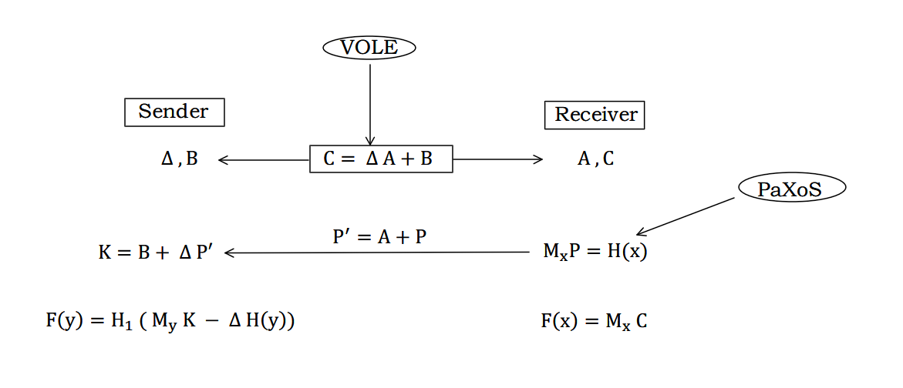

# Proposal
Edited By 
牛午甲 PB20111656
潘云石 PB20111657
石磊鑫 PB20111658
孙霄鹍 PB20111659
陈&nbsp;&nbsp;&nbsp;昊 PB20051077
## Abstract
隐私集合求交（Private Set Intersection，PSI）是一种密码学技术，它允许两个或多个参与方在不泄露任何额外信息的情况下，计算出他们各自持有数据的交集。PSI 在数据安全、医疗保健、社交网络等领域有着广泛的应用前景。我们的研究旨在调研和分析隐私集合求交（PSI）的现有技术方案，探索其在不同场景下的应用和改进。在这篇proposal中，我们首先对 PSI 的相关概念、背景知识进行介绍，然后对 PSI 的主要技术方案进行综述，包括基于公钥密码学、通用安全计算、同态加密、不经意传输等方法的 PSI 协议。另外我们也调研了近年来提出的一些改进方法。接着，我们提出了一些可能的研究目标和方法，例如基于双线性映射、秘密共享、模逆、对称加密等技术的 PSI 协议。最后，我们给出了一个大体的执行计划。
## Related Works
### Background Materials
#### Private Set Intersection (PSI)
私有集合求交 (PSI) 是一种安全多方计算的密码学技术，它允许各自持有集合的两方比较这些集合的加密版本以计算交集。在这种情况下，除了交集中的元素外，任何一方都不会向交易对手透露任何信息。形式化地，两方各自拥有集合 $S=\{s_1,s_2,...,s_n\}$ 和 $S'=\{s_1',s_2',...,s_n'\}$，其中 $s_i,s_i'\in\{0,1\}^\sigma$ 并且假设 $S,S'$ 中各自都没有重复的元素。目标：各方计算 $I=S\cap S'$，不泄露除了 $I$ 之外的任何信息。

#### Adversary Model
**Semi-honest Model**：完全按照密码学的协议执行，但会尽可能尝试从收到的信息中获取额外的信息。
**Malicious Model**：可以不严格按照密码学的协议执行，可以做任何事情来达到获取额外信息的目的。

#### Secret Sharing
秘密共享是将一份原始秘密信息，拆分成多份。再把多份数据，分给不同的用户持有。其中的任何一份数据，都不能够完全恢复原始的秘密信息。只有达到指定数量的用户，集合他们手中持有的秘密，经过计算才能得出原始的秘密信息。

#### Homomorphic Encryption (HE)
同态加密是将数据加密后，对加密数据进行运算处理，之后对数据进行解密，解密结果等同于数据未进行加密，并进行同样的运算处理。

#### Yao's Garbled Circuits
使用布尔电路（与，或，非等）构建电路表，保障计算的过程中，双方的数据不被泄露。最终根据混淆电路的计算结果，以及混淆电路表，可以计算双方数据的计算结果。

#### Oblivious Transfer
不经意传输协议由发送方和接收方两方参与，接收方请求获取信息，发送方发送信息给接收方。在这个过程中，发送方对接收方的请求信息一无所知，同时接收方也无法获取请求的信息之外的额外信息。

#### Cuckoo Hashing
Cuckoo hashing 是一种开放寻址形式，其中哈希表的每个非空单元格都包含一个键或键值对。散列函数用于确定每个键的位置，并且可以通过检查表的该单元格找到它在表中的存在（或与其关联的值）。但是，开放寻址会发生冲突，当多个键映射到同一个单元格时会发生这种情况。Cuckoo hashing 的基本思想是通过使用两个哈希函数而不是一个来解决冲突，这为每个键提供了哈希表中的两个可能位置。

### Survey
[Private Set Intersection: Past, Present and Future](https://www.scitepress.org/Papers/2021/105258/105258.pdf)

### SOTA Methods
#### Naive PSI
- 主要想法：对各参与方的集合进行哈希，直接比较哈希后的结果。
- 已被证明是不安全的：
  - 输入数据值较小时可以遍历攻击；
  - 不满足前向安全性：攻击者可以借助先前泄露的信息部分构建遍历表。

#### Public-key Cryptography-based PSI
##### Diffie Hellman
- [A more efficient cryptographic matchmaking protocol for use in the absence of a continuously available third party](https://ieeexplore.ieee.org/document/6234849) 1986
  - 安全性基于离散对数问题和大数因子分解问题。
  - 需要一个可信第三方，但不要求它对用户总是可访问的

##### RSA
- [Practical private set intersection protocols with linear complexity](https://eprint.iacr.org/2009/491.pdf) 2010
安全性基于 one-morediscrete-logarithm or one-more-RSA assumptions in
the random oracle model.
  - 由于 RSA 计算复杂度较高，协议中 RSA 的计算次数会随着数据量的增大呈线性增长，使得基于 RSA 的求交方法，在数据量较大时会产生性能问题。
  - 由于 RSA 盲签名算法在运行时只对一端的数据进行 RSA 加密，使得在求交数据量级差距较大时，可以把数据量较小的一端作为 Client 端，这样可以获得非常大的性能优势。另外，RSA 算法的流程适合并行处理，方便利用并行计算来提升性能。
  - RSA 盲签名协议能够在恶意对手模型下，为隐私集合求交提供安全保障，但由于非对称加密的次数随比对的数量量的增加呈线性增长，所以无法处理海量数据的隐私集合求交场景。

#### Generic Secure Computation-based PSI(semi-honest)
- [Private set intersection: Are garbled circuits better than custom protocols?](https://www.cs.umd.edu/~jkatz/papers/psi.pdf) 2012
  > 通用安全计算协议：允许双方安全地计算任何可以表示为布尔电路的函数。
  > Yao’s garbled circuits protocol：通用安全计算协议的一种。
  - 基于 Yao’s garbled circuits 设计了三种针对不同集合大小和领域的PSI协议。
  - 主要想法：让每一方在本地对他们的集合进行排序，然后将他们的排序集合合并到一个排序列表中(privately)。然后比较每个相邻的元素对(obliviously)，如果元素对中的元素相等，则保留值，否则替换成 dummy value。最后，在显示整个列表之前，匹配/虚拟元素的结果列表被显示地 shuffle（shuffle 是必要的，否则匹配元素的位置信息会泄露双方集合中不匹配元素的信息）。
  - 结论：通过依赖现有的软件包来构建乱码电路协议，人们只需要为要计算的功能编写一个电路，而不必从头开始设计和实现一个新的协议。通用协议本身也比定制协议更加模块化。基于通用安全计算的协议可以提供与最快的自定义协议竞争的性能；通用协议可以直接用于执行更复杂的安全计算。

#### Homomorphic Encryption-based PSI

- [Fast Private Set Intersection from Homomorphic Encryption](https://eprint.iacr.org/2017/299.pdf) 2017
  - 对数据进行同态加密，并使用加密后的数据和原始数据构建多项式并计算多项式的值。
  - 不足：同态加密算法目前是一种低效的加密算法，全同态加密的密文长度通常非常大，使得目前基于同态加密的隐私集合求交方案在性能上不占据优势。
  - 提出的方案，只对接收者一侧执行同态加密，这使得算法适合运行在求交的集合差异较大的场景。

#### Oblivious Transfer-based PSI
- [Faster private set intersection based on OT extension](https://eprint.iacr.org/2014/447.pdf) 2014
  - 基于 OT 扩展协议实现了高效隐私集合求交方案，传输数据使得通信双发获得一个伪随机函数，并使用此伪随机函数对双方持有的数据进行加密比对。
  - 方案主要分为三个阶段来执行：哈希阶段、隐秘传输阶段和求交阶段。在哈希阶段，通信 Alice 和 Bob 把各自持有的数据通过哈希运算均匀分布在一个给定大小的地址空间内，并使用随机数填充空余的哈希位置。在隐秘传输阶段，Bob 根据自己持有数据的比特信息作为选择位，使用 OT 扩展安全地获取 Alice 持有同样比特位置上的伪随机生成数据。最后在求交阶段，Bob 解密伪随机数据，并和自己持有的而数据进行比较。

- [Efficient batched oblivious PRF with applications to private set intersection](https://eprint.iacr.org/2016/799.pdf) 2016
  - 提出一种轻量级的协议，可以在存在半诚实的对手的情况下对伪随机函数（OPRF）进行不经意计算。
  - 使用 batched OT 扩展传输和 Cuckoo hashing 实现了更高效的隐私集合求交方案，基于 OT 的隐私集合求交成为性能上最接近朴素哈希求交技术的隐私集合求交方案。

- [SpOT-Light: Lightweight Private Set Intersection from Sparse OT Extension](https://eprint.iacr.org/2019/634.pdf) 2019
  - 基于稀疏扩展的隐私集合求交方案，方案首先把秘密信息分成三份，这样在未获取到要求交的数据之前，可以提前随机生成两份秘密信息，以便在离线阶段进行 OT 扩展传输，提前获取伪随机生成函数。
  - 在在线阶段，为了避免传输大量的秘密信息，方案使用了多项式技术，把要传输的数据融入多项式，仅传递多项式的参数来代替传输大量数据。
  - 根据该方案的测试结果，在要对比的数据量庞大，或者带宽受限制场景下，此方案相较于目前最优的基于 OT 的隐私集合求交方案，提供了更好的性能优势。

### Improvement Approaches
- [Practical multi-party private set intersection from symmetric-key techniques](https://eprint.iacr.org/2017/799.pdf) 2017
  - 针对多参与方 PSI 设计了一种模块化方法，可以防止任意数量的 semi-honest parties 串通。
  - 通过对称加密方式降低加密计算开销，提升协议性能。
  - 主要思想：各参与方生成零的加性共享。即各参与方 $\{P_i\}$ 给自己拥有的每个元素 $\{x_j\}$ 生成一个 share $\{s_j^i\}$，满足 $\sum_{i=1}^ns_j^i=0$. 即如果所有参与方的集合中都有 $x_j$，那么他们的 share 之和为零。然后每个参与方 $P_i$ 运行一个 OPPRF 实例，当对输入 $x_j$ 求值时输出它的 share $\{s_j^i\}$。直观地，如果各方在相同的值 $x_j$ 上评估相应的 OPPRF，则 OPPRF 输出的和为零。

- [PSI from PaXoS:Fast, Malicious Private Set Intersection](https://eprint.iacr.org/2020/193.pdf) 2020
  - 提出一种两方 PSI 的新协议，半诚实版本和恶意版本之间的唯一区别是线性纠错码具有不同参数的实例化。
  - 通过一种新的数据结构：probe-and-XOR of strings 把 cuckoo hashing 应用于 malicious 场景下的 PSI。
  - PaXoS 数据结构原理：将n个二进制字符串映射到m个二进制字符串，其中n个原始字符串中的每一个都可以通过对m个字符串的特定子集进行异或来检索。
    
  - 在传统 Cuckoo hashing 基础上的改进：不是将 item 存储在哈希函数确定的两个位置中的一个，而是将这两个位置的异或值作为存储的值。**消除了在 malicious PSI 中使用 cuckoo hashing 的不足：因为各参与方不需要在两个存储 item 的位置中选择一个，因此不会通过 Cuckoo hashing 泄露任何信息**。

- [VOLE-PSI: Fast OPRF and Circuit-PSI from Vector-OLE](https://eprint.iacr.org/2021/266.pdf) 2021
  - 提出了一种结合 Vector-OLE 和 PaXoS 数据结构的快速 OPRF 和 PSI 协议，比之前的研究在通信和运行时间上均具有更好的性能。
  - 证明了与半诚实的变体相比，提出的协议可以在没有额外开销的情况下实现 malicious security。
  - PSI from OPRF based on VOLE and OKVS 的简要原理
    1. OPRF using VOLE
         1. 随机VOLE：能在没有输入的情况下，生成满足$C = \Delta A + B$的向量$A,B,C \in \{0,1\}^m $,以及标量$\Delta$, 使接收者R持有A,C, 发送者S持有B,$\Delta$.
         2. 假设R的数据集为$X$,在随机矩阵$M^*$上按$X = \{x_1,\dots,x_n\}$抽取行构成$M_x$
         3. 求解线性系统$M_x P = H(x)$, 作者使用PaXoS来加速求解.
         4. R将A + P发送给S, 可定义$K=B+\Delta P$.此时有$$M_x K = M_x(B+\Delta P) = M_xB+\Delta(M_xA + M_xP) = M_xC + H(x)$$ 所以函数输出$F(y) = H_1(M_yK - \Delta H(y)),F(x) = H_1(M_x C)$,
          这样,当 $x=y$ 时, $M_yK - \Delta H(y) = M_x C$, 有 $F(x) = F(y)$
          
    2. PSI from OPRF 
        1. OKVS: 一种key-value结构, 可以把n个$(x_i,y_i)$一次性编码存到长为m的比特串中, 且能解码$x_i$, 从中抽取出$y_i$.
        2. R 和 S各选择一个随机数$\omega ^r, \omega ^s$, 相互交换后计算$\omega = \omega ^r + \omega ^s$
        3. 在上面的基础上使用OKVS进行编码: $P = Dncode(x,H(x))$, 最终输出函数为$F(y) = H_1(\omega + Decode(K,y) - \Delta H(y))$
        $F(x) = H_1(\omega + Decode(C,x))$
        4. S将F(y)发送给R, R输出$F(x) \bigcap F(y)$
        5. 这仍可保证正确性, 因为
           $Decode(K,y) - H(y) 
        \\= Decode(B + \Delta(P + A),y) - \Delta H(y) 
        \\= Decode(C + \Delta P ,y) -\Delta H(y) 
        \\= Decode(C,y) + \Delta Decode(P,y) - \Delta H(y)
        \\= Decode(C,y) + \Delta H(y) - \Delta H(y) 
        \\= Decode(C,y)$
        所以当$x = y$时, $F(x) = F(y)$.
  - 协议性能：在带宽受限的环境下具有更好的通信和运行时间性能，但在通信量方面存在反弹性；解决了以往实现 OPRF 和 PSI 协议中存在的运算负担、数据量等问题。
  - 本文提出的方法在数据结构方面还存在改进的空间。
  - 提出基于 VOLE 的一个扩展，使 PSI 的输出可以在双方之间秘密共享(Circuit-PSI)。
  - 提出将 PaXoS 求解器与任何 OPRF 协议一起使用能够生成 Oblivious Programmable PRF (OPPRF) 协议。

- [Circuit-PSI with Linear Complexity via Relaxed Batch OPPRF](https://eprint.iacr.org/2021/034.pdf) 2021
  - 在 B-OPPRF 的基础上提出 RB-OPPRF，利用 Cuckoo hashing 代替了多项式插值，将 Circuit PSI 协议的计算复杂度和通信复杂度同时降为 $O(n)$。
  - 结合提出的 RB-OPPRF 建立了更高效的 PSM 协议（PSM：A 有数据 $a$，B 有数据集 $X$，希望知道 $a$ 是否属于 $X$）。
  - 主要想法：对两方的数据集 $P_0$ 和 $P_1$，先用 Cuckoo hashing 将原本的 PSI 问题转换为多个数据集规模为 $O(\log n)$ 的 PSM 问题，然后通过 RB-OPPRF 的方法来减少最终需要比较的次数来减小复杂度，达到线性复杂度。
- [Oblivious key-value stores and amplification for private set intersection](https://eprint.iacr.org/2021/883.pdf) 2021
  - 基于*将 PSI 协议输入集编码为多项式* 这一基本想法，提出了更一般的概念 **Oblivious key-value stores (OKVS)**，将希望存储的映射关系隐藏在多项式中。
  - 不足：目前的分析技术不足以找到具体的参数来保证 OKVS 结构的小失效概率。文章中的补救办法是通过把一个失效概率为 $p$ 的 OKVS 放大到具有相似开销且失效概率为 $p^c$ 的 OKVS，通过做 $O(\frac{1}{p})$ 次的实验来间接验证放大后的 OKVS。

- [Blazing Fast PSI from Improved OKVS and Subfield VOLE](https://eprint.iacr.org/2022/320.pdf) 2022
  - 对 Rindal et al. 的协议进行优化，利用 sub-field 向量不经意线性求值，把通信复杂度降到 $O(n\lambda + n \log n)$，并且通信开销不随 $\lambda n$ 扩展。
  - 对 Garimella et al. 提出的 OKVS 数据结构进行改进，基于 Cuckoo hashing 提出了一个理论框架，具体求解失败概率更 tight 的上界，提高了计算和通信效率。
  - 采用改进的 OKVS，提出了迄今为止最高效的 PSI 协议。

### Limitations
- 目前的各种技术方案，缺少标准的对抗手段来证明其确实在实际应用中保护了数据安全。以及缺少基于隐私集合求交的各种标杆性应用。
- 协议设计中使用的许多随机化算法，目前的分析技术都难以从理论上给出一个具体的参数来保证其具有小失效概率。
- 性能的优化是永无止境的......

## Research Problems
- 目前大多数对于 PSI 的研究都是基于半诚实模型。在 Malicious Model 中，协议需要使用额外的手段来降低被攻击的可能，因此 Malicious Model 下安全的协议的复杂程度和开销往往远大于半诚实模型下安全的协议，有没有可能基于其他出发点，设计性能接近半诚实方案的 Malicious PSI 模型？
- 目前非平衡隐私集合求交的应用场景有很多，如某些 APP 的联系人寻找，而目前调研到的文章没有提到对于非平衡隐私集合求交的特别处理，即一个集合很小，一个集合很大时的情况，当前的非平衡PSI协议相较于平衡的PSI协议性能优势并不是很明显，是否可以通过特殊的办法使得非平衡隐私集合求交的效率显著高于平衡的隐私集合求交？
- 除了目前工作的理论支撑外，有没有可能存在其他理论方法可以用来解决 PSI 问题？

## Methodologies
我们打算从综述中提到的方案出发，进一步调研、实验，尝试寻找进一步提升 performance 的可能方案。
### Bilinear Maps
基于双线性映射的一种可能可行的隐私集合求交方法。假设参与方 A 拥有集合 $S=\{a_1,a_2,...,a_v\}$，参与方 B 拥有集合 $S'=\{b_1,b_2,...,b_w\}$。$e(\cdot,\cdot)$ 是双线性函数。
A 生成秘密参数 $s_1$，并将公开的参数 $p_1,g^{s_1}$ 以及加密后的 $S$ 集合 $\{g^{a_1s_1},g^{a_2s_1},...,g^{a_vs_1}\}$ 发给 B。B生成秘密参数 $s_1$，公开参数 $p_2$，去验证 $e(g^{a_is_1p_1},g^{\frac{s_2p_2}{b_j}})$ 和 $e(g^{s_1},g^{p_1s_2p_2})$ 是否相等。
### Secret Sharing
参与方 A 将自己拥有的集合 $S=\{a_1,a_2,...,a_v\}$ 同态加密后和 sec 一起发送给参与方 B，同样的 B 同态加密自己的集合 $S'=\{b_1,b_2,...,b_w\}$ 并且用加密后的自己集合中的元素逐个尝试替换加密后的集合 A 中的元素；此外，B 在替换过程中检查 sec 值是否等于 A 发过来的 sec 值，从而得到集合的交。
### Modular Inverse
参与方 A 选取一个随机数 $a$ 发送给 参与方 B，B 对自己拥有集合中的每个元素 $b_i$ 计算 $ax_i\equiv 1(mod\ b_i)$，并将 $\boldsymbol{x}$ 发送给 A，A 再对每个 $a_j$ 验证是否有 $ax_i\equiv 1(mod\ a_j)$.

> 注：我们初步认为如果利用有限域模逆的唯一性，更有说服力的思路应该是这样：参与方 A 选取一个随机大素数 $p$ 发送给参与方 B，B 对自己拥有集合中的每个元素 $b_i$ 计算 $b_ix_i\equiv 1(mod\ p)$，并将 $\boldsymbol{x}$ 发送给 A，A 再对每个 $a_j$ 计算 $a_jx_i\equiv 1(mod\ p)$ 是否成立。
### Symmetric Encryption
参与方 A 生成一个随机数 $r$ 和 $v$ 个随机数 $\{r_i\}_v$，计算 $c_i=Enc_{a_i+r}(a_i||r_i||len(r_i))$，将 $\{c_i\}_v$ 和 $r$ 发给参与方 B。B 尝试使用 $b_j+r$ 解密，如果 $Dec_{b_j+r}(c_i)=b_j||random||l(random)$，则说明 $a_i=b_j$.

## Execution Plan
- 4.24 - 5.14 深入调研上面部分文章的技术细节以及实验代码，总结技术上的相同点与各自的特性；
- 5.15 - 6.4 从理论或者实践上寻找可能改进的地方，或者基于现有理论寻找在新的场景方面的应用，尝试做出相应的理论证明或者实验验证；
- 6.5 - 6.11 撰写结题报告。

## Reference
1. Wikipedia. Private set intersection. https://en.wikipedia.org/wiki/Private_set_intersection
2. Wikipedia. Secret Sharing. https://en.wikipedia.org/wiki/Secret_sharing
3. 隐私集合求交（PSI）协议研究综述. https://zhuanlan.zhihu.com/p/594370613
4. Private Set Intersection: Past, Present and Future https://www.scitepress.org/Papers/2021/105258/105258.pdf
5. A more efficient cryptographic matchmaking protocol for use in the absence of a continuously available third party https://ieeexplore.ieee.org/document/6234849
6. Practical private set intersection protocols with linear complexity https://eprint.iacr.org/2009/491.pdf
7. Private set intersection: Are garbled circuits better than custom protocols? https://www.cs.umd.edu/~jkatz/papers/psi.pdf
8. Fast Private Set Intersection from Homomorphic Encryption https://eprint.iacr.org/2017/299.pdf
9. Faster private set intersection based on OT extension https://eprint.iacr.org/2014/447.pdf
10. Efficient batched oblivious PRF with applications to private set intersection https://eprint.iacr.org/2016/799.pdf
11. SpOT-Light: Lightweight Private Set Intersection from Sparse OT Extension https://eprint.iacr.org/2019/634.pdf
12. Practical multi-party private set intersection from symmetric-key techniques https://eprint.iacr.org/2017/799.pdf
13. PSI from PaXoS:Fast, Malicious Private Set Intersection https://eprint.iacr.org/2020/193.pdf
14. VOLE-PSI: Fast OPRF and Circuit-PSI from Vector-OLE https://eprint.iacr.org/2021/266.pdf
15. Circuit-PSI with Linear Complexity via Relaxed Batch OPPRF https://eprint.iacr.org/2021/034.pdf
16. Oblivious key-value stores and amplification for private set intersection https://eprint.iacr.org/2021/883.pdf
17. Blazing Fast PSI from Improved OKVS and Subfield VOLE https://eprint.iacr.org/2022/320.pdf